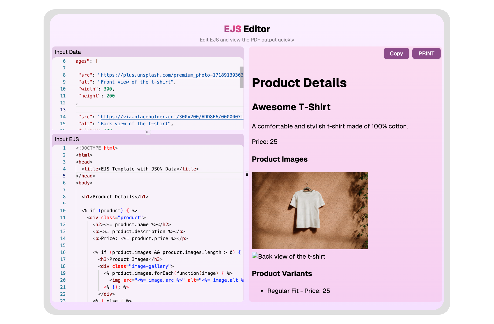

# EJS Editor

A web-based editor for EJS (Embedded JavaScript) templates with live preview functionality.

Try it out here https://ejs-editor.vercel.app/

## Features

- Real-time preview of rendered EJS templates
- Split-pane interface with resizable panels
- JSON data input support for template variables
- Syntax highlighting for both EJS and JSON
- Print functionality for rendered output

## Technology

Built using:

- Next.js for the framework
- Monaco Editor for code editing
- TailwindCSS for styling
- TypeScript for type safety

## Usage

1. Enter your EJS template code in the template editor
2. Add JSON data in the data editor if needed
3. See the rendered output update in real-time
4. Use the print function to generate PDFs of the output

## Safety Note

This editor executes JavaScript code directly as part of the EJS template rendering. Only use trusted code and data in the editor.
